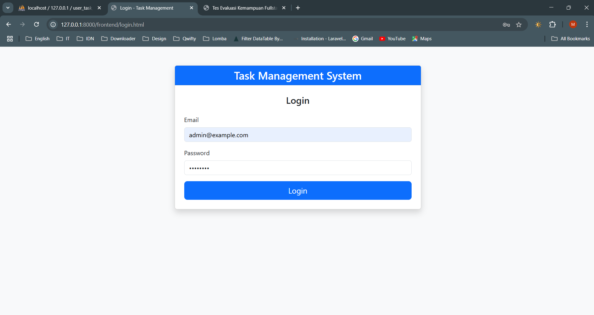
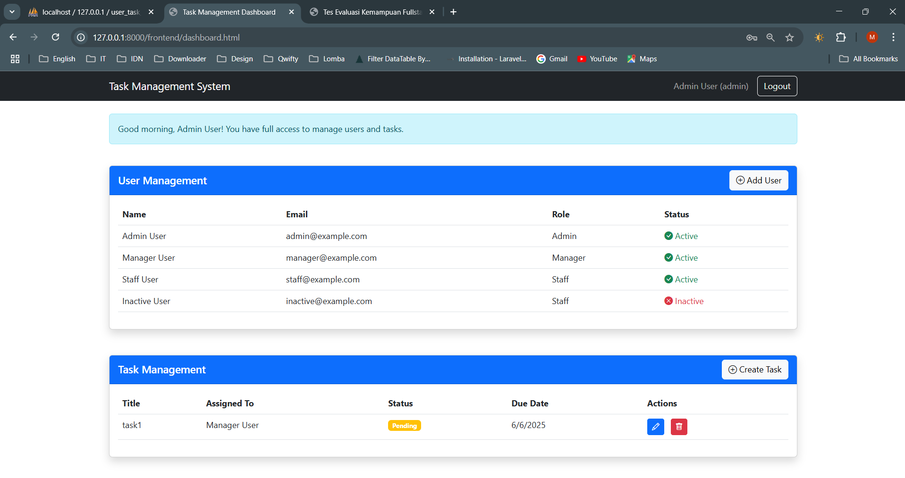
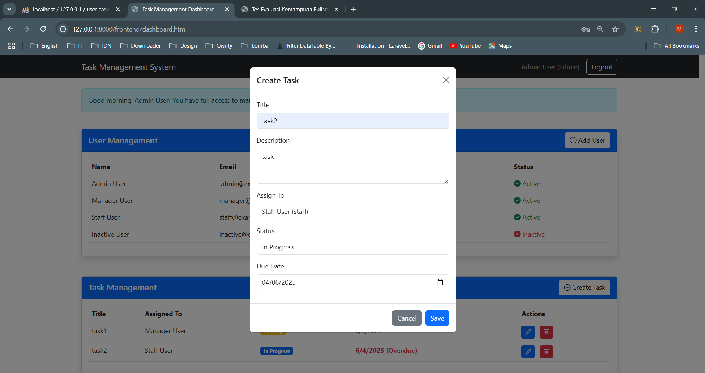
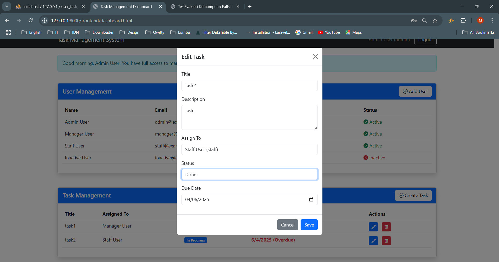
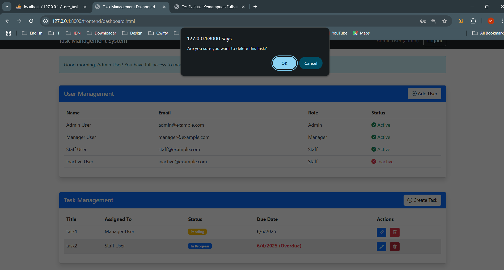
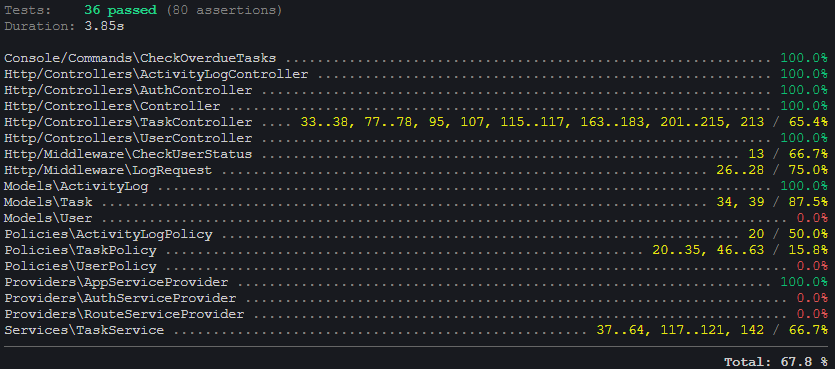

# Task Management System

A comprehensive RESTful API task management system built with Laravel and Vanilla JavaScript, featuring role-based access control, business logic validation, and batch data processing.

## 🚀 Features

### Backend (Laravel)
- **Role-based Access Control**: Admin, Manager, and Staff roles with specific permissions
- **RESTful API**: Complete CRUD operations for users, tasks, and activity logs
- **Authentication**: Laravel Sanctum for secure API authentication
- **Business Logic**: Task assignment validation and overdue task detection
- **Activity Logging**: Comprehensive logging of user actions
- **Middleware**: Custom middleware for user status checking and request logging

### Frontend (Vanilla JavaScript + Bootstrap)
- **Responsive Dashboard**: Clean, modern interface with Bootstrap styling
- **Role-based UI**: Different interfaces based on user roles
- **Real-time Updates**: AJAX-powered interactions
- **Form Validation**: Client-side and server-side validation

## 📊 Entity Relationship Diagram

### User
- `id`: UUID (Primary Key)
- `name`: String
- `email`: String (Unique)
- `password`: Hashed
- `role`: Enum (admin, manager, staff)
- `status`: Boolean (active/inactive)

### Task
- `id`: UUID (Primary Key)
- `title`: String
- `description`: Text
- `assigned_to`: UUID (Foreign Key to User)
- `status`: Enum (pending, in_progress, done)
- `due_date`: Date
- `created_by`: UUID (Foreign Key to User)

### Activity Log
- `id`: UUID (Primary Key)
- `user_id`: UUID (Foreign Key to User)
- `action`: String
- `description`: Text
- `logged_at`: DateTime

## 🔐 Role Permissions

| Role | View Users | Manage Tasks | Assign Tasks | View Logs |
|------|------------|--------------|--------------|----------|
| Admin | ✅ | ✅ | ✅ | ✅ |
| Manager | ✅ | ✅ (own team) | ✅ (to staff) | ❌ |
| Staff | ❌ | ✅ (self only) | ❌ | ❌ |

## 🛠️ Installation & Setup

### Prerequisites
- PHP 8.1+
- Composer
- Node.js & NPM
- MySQL/SQLite
- Docker (optional)

### Local Setup

1. **Clone the repository**
   ```bash
   git clone <repository-url>
   cd user-task-management-laravel
   ```
2. **Install PHP dependencies**
   ```bash
   composer install
   ```
3. **Configure the environment**
   ```bash
   cp .env.example .env
   php artisan key:generate
   ```
4. **Set up the database**
   ```bash
      # For SQLite (default)
      touch database/database.sqlite

      # Or configure MySQL in .env file
      # DB_CONNECTION=mysql
      # DB_HOST=127.0.0.1
      # DB_PORT=3306
      # DB_DATABASE=task_management
      # DB_USERNAME=root
      # DB_PASSWORD=
   ```
5. **Migrate the database and seeders**
   ```bash
   php artisan migrate:fresh --seed
   ```
6. **Start the server**
   ```bash
   php artisan serve
   ```
7. **Access the application**
   - API: http://localhost:8000/api
   - Frontend: http://localhost:8000/frontend/login.html
   
### Docker Setup
1. Build and start containers
   
   ```
   docker-compose up -d --build
   ```
2. Install dependencies
   
   ```
   docker-compose exec app composer install
   ```
3. Setup environment and database
   
   ```
   docker-compose exec app cp .env.example .env
   docker-compose exec app php artisan key:generate
   docker-compose exec app php artisan 
   migrate:fresh --seed
   ```
4. Access the application
   
   - API: http://localhost:8080/api
   - Frontend: http://localhost:8080/frontend/login.html
   - phpMyAdmin: http://localhost:8081

## 📚 API Documentation
### Authentication Login
```
POST /api/login
Content-Type: application/json

{
  "email": "admin@example.com",
  "password": "password"
}
```
Response:

```
{
  "access_token": "1|abc123...",
  "token_type": "Bearer",
  "user": {
    "id": "uuid",
    "name": "Admin User",
    "email": "admin@example.com",
    "role": "admin",
    "status": true
  }
}
```
### Users Get All Users (Admin & Manager only)
```
GET /api/users
Authorization: Bearer {token}
``` Create User (Admin only)
```
POST /api/users
Authorization: Bearer {token}
Content-Type: application/json

{
  "name": "New User",
  "email": "user@example.com",
  "password": "password",
  "role": "staff",
  "status": true
}
```
### Tasks Get All Tasks (Role-based filtering)
```
GET /api/tasks
Authorization: Bearer {token}
``` Create Task
```
POST /api/tasks
Authorization: Bearer {token}
Content-Type: application/json

{
  "title": "Task Title",
  "description": "Task Description",
  "assigned_to": "user-uuid",
  "due_date": "2024-12-31"
}
``` Update Task
```
PUT /api/tasks/{id}
Authorization: Bearer {token}
Content-Type: application/json

{
  "title": "Updated Title",
  "status": "in_progress"
}
``` Delete Task (Admin/Creator only)
```
DELETE /api/tasks/{id}
Authorization: Bearer {token}
```
### Activity Logs Get All Logs (Admin only)
```
GET /api/logs
Authorization: Bearer {token}
```
## 🧪 Testing
### Run All Tests
```
php artisan test
```
### Run with Coverage
```
php artisan test --coverage
```

## Screenshots

### 🔐 Login Page

Halaman autentikasi pengguna dengan validasi role-based access.

### 📊 Dashboard

Dashboard utama yang menampilkan task berdasarkan role pengguna.

### ➕ Create Task

Form pembuatan task dengan validasi input.

### ✏️ Edit Task

Interface untuk mengedit task yang sudah ada.

### 🗑️ Delete Task

Konfirmasi penghapusan task.

### ✅ Test Results

Hasil pengujian yang menunjukkan coverage lengkap.

## 🏗️ Business Logic & Rules
### Role-based Constraints
- Admin : Full access to all features
- Manager : Can view users, manage own team tasks, assign tasks to staff
- Staff : Can only view and manage self-assigned tasks
### Business Rules
- Users with status: inactive cannot login
- Managers can only assign tasks to staff members
- Users can only see tasks created by them or assigned to them
- Task overdue detection runs automatically via scheduler
### Task Assignment Logic
- Admin : Can assign tasks to any user
- Manager : Can assign tasks to staff members and themselves
- Staff : Cannot assign tasks to others

## 👥 Default User Credentials
Role Email Password Status 
Admin admin@example.com password (Active)
Manager manager@example.com password (Active)
Staff staff@example.com password (Active) 
User inactive@example.com password (Inactive)

## 🛠️ Technologies Used
- Backend : Laravel 11, PHP 8.1+
- Database : MySQL/SQLite
- Authentication : Laravel Sanctum
- Frontend : Vanilla JavaScript, Bootstrap 5
- Testing : PHPUnit
- Containerization : Docker, Docker Compose
- Task Scheduling : Laravel Scheduler